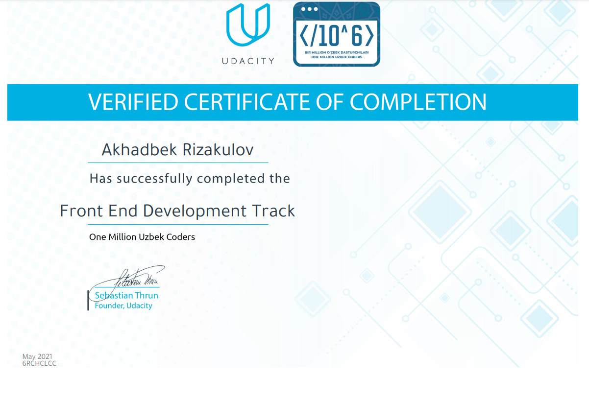
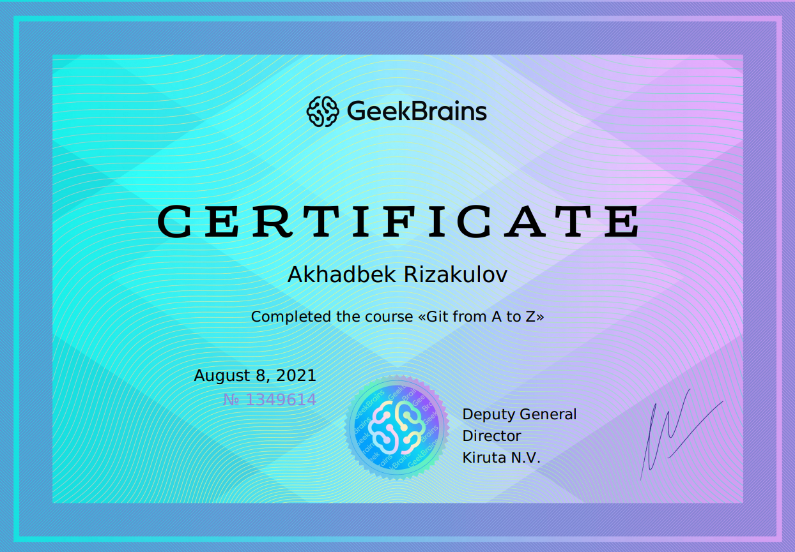

# Front-End Developer

## Personal Info

* **First Name**: Akhadbek
* **Last Name**: Rizakulov
* **Date of Birth**: 02.08.2002

## Contacts

* **Phone**: +998 (93) 391-4-391
* **Email**: abdulaxadrizakulov@gmail.com
* **Telegram**: [@SpeedyM_282](https://t.me/SpeedyM_282)
* **LinkedIn**: [Abdulakhad Rizakulov](https://www.linkedin.com/in/abdulakhad-rizakulov-181a50210)

## About Myself

*I am Student at INHA University in Tashkent and now learning Front-End Developemt to start my career in IT sphere.\
I started learning Front-End Development in August of 2020 and already made some mini-projects using `HTML`, `CSS` and `JavaScript`.\
Also, in university I have learned `C++`, `Java` and made about 15 mini-projects with these programming languages.\
Currently, I am interested in learning `ReactJS`, because it is very popular and powerful `JavaScript` framework.\
All my projects you can find in my `GitHub` page.*

## Skills

* C++ (OOP)
* Java (OOP)
* HTML
* CSS
* JavaScript
* Git, GitHub
* VS Code, IntelliJ IDEA

## Education

**INHA University in Tashkent** - `2020-2024`
> School of Computer and Information Engineering

## My code Examples

***JavaScript Code Example***
```
function changeMode(){
  if(document.getElementById('onOff').checked == true){
    document.getElementById('body-part').style.backgroundColor = "rgb(59, 59, 59)";
    alert("Dark Mode");
  }
  else{
    document.getElementById('body-part').style.backgroundColor = "aliceblue";
    alert("Light Mode");
  }
}
```

## Passed Courses

1. *Online Digital Camp - Front-End Development Track* - **Digital Generation Uzbakistan** (August 2020)
2. *Front-End Development Track* - **Udacity** (May 2021)
3. *HTML, CSS, JavaScript from zero to expert* - **Udemy** (May 2021)
4. *JavaScript & jQuery for Beginners* - **Udemy** (May 2021)
5. *Complete Responsive Web Development* - **Udemy** (May 2021)
6. *ReactJS for Front-End* - **Udemy** (June 2021)
7. *JavaScript for ReactJS* - **Udemy** (June 2021)
8. *HTML, CSS, JavaScript for Beginners* - **Udemy** (June 2021)
9. *JavaScript for Beginners* - **Udemy** (June 2021)
10. *Git from A to Z* - **GeekBrains** (August 2021)

## Certificates

    
    
    

## Languages

* **Uzbek** - Native
* **Russian** - C1
* **English** - B1
